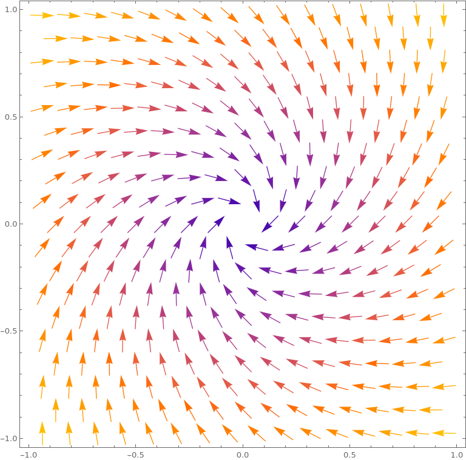
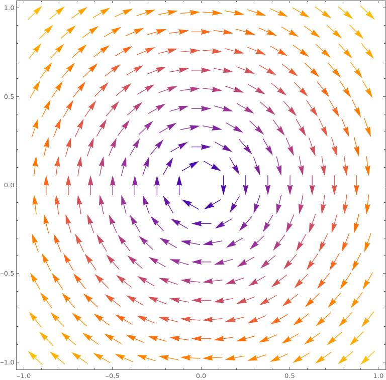
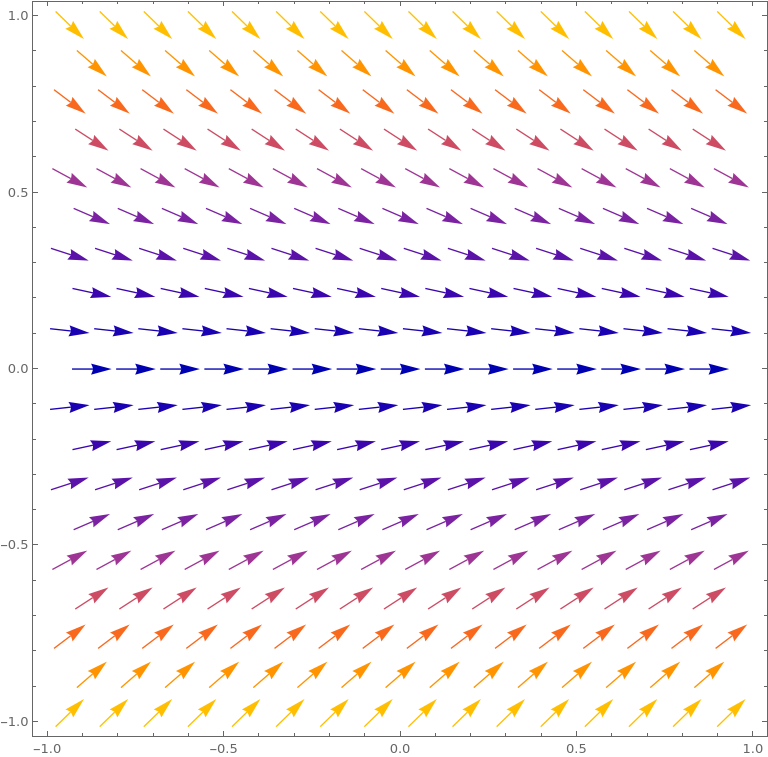

# Implementation plans

## Advection matrix:

Let $b = (b_1, b_2, b_3 ...)$ be a row-vector  (a vector valued function) represeting a fluid's velocity field.
Then, the local advection matrix can be written as (in index form):

$$
C_{i, j}^\kappa = (\bar{b} \cdot \nabla \phi_j, \phi_i)_\kappa
$$

For the global basis. 

Equivalently:

$$
C_{i, j}^\kappa = \iint_\kappa \bar{b} \cdot \nabla \phi_j \phi_i d\kappa
$$

In matrix form:

$$
C^\kappa = \iint_\kappa \Phi^T (\bar{b}\nabla \Phi)  d\kappa
$$

Where $\Phi = (\phi_1, \phi_2, ...)$ - row vector with the non-zero over $\kappa$ basis functions (from the global basis).

Changing to the standart element $E$ we obtain:

$$
C^\kappa = \iint_E \Psi^T (\bar{b} J ^{-1} \nabla \Psi) |J| dE
$$

Finally, for the local advection matrix we obtain:

$$
C^\kappa = |J| \iint_E \Psi^T b J ^{-1} \nabla \Psi dE
$$

The integral is then approximated with a quadrature formula and the global matrix is assembled as usual.

### Sanity check:

Let the problem be $n$-dimensional.

Let the number of shape functions be $m$.

$dim (\Psi^T) = (m, 1)$ - column vector

$dim(b) = (1,n)$ - row vector

$dim(J^{-1}) = (n,n)$ - matrix

$dim(\nabla \Psi) = (n , m)$ - matrix

Therefore:

$(m, 1) \times (1,n) \times (n,n) \times (n , m) \rightarrow (m, m)$

### Tests

Vector fields to test over the circle mesh:

1. $\bar{f}(x,y) = (y-x, -x-y)$

    

2. $\bar{f}(x,y) = (y, -x)$

    

3. $\bar{f}(x,y) = (y, -x)$

    

## Least Squares Stabilization of transport problems

Start with:

$$ 
(Lu, v)  = (f, v), \forall v \in V \rightarrow FEM
$$

$$
    (Lu, Lv) = (f, Lv), \forall v \in V \rightarrow LSQ
$$

$$
    (Lu, v + \delta Lv) = (f, v + \delta Lv)
$$

Let: 

$$
Lu = -\epsilon\nabla ^ 2 u + \bar{b} \cdot \nabla u
$$

Then we obtain the "combined" bilinear form:

$$
    a_{h} (u, v) = a(u,v) + \delta \sum_{\kappa \in K} (- \epsilon\nabla^2 u + \bar{b} \cdot \nabla u, -\epsilon\nabla^2 v + \bar{b} \cdot \nabla v)_{L^2(K)}
$$

And the "combined" linear functional:

$$
    l_{h}(v) = l(v) + \delta \sum_{\kappa \in K} (f, - \epsilon\nabla^2 v + \bar{b} \cdot \nabla v)_{L^2(K)}
$$

For general elements.

In the case of linear elements ( $\nabla^2 v = 0$ ) the above equations get simplified to:

$$
a_{h} (u,v)  =  \epsilon(u,v) + (\bar{b}\cdot \nabla u, v) + \delta (\bar{b} \cdot \nabla u, \bar{b} \cdot \nabla v)
$$

$$
l_{h} (v) = (f,v) + \delta (f, \bar{b}\cdot \nabla v)
$$

### Choice of $\delta$

If $\epsilon > h$ :

$$
        \delta = C h^2
$$

else:

$$
    \delta = C h /||b||_{L^{\infty}(\Omega)}
$$

### Discretization and Matrix formulation

TODO

### Error estimate

$$
||| u-u_h ||| = O(h^{3/2})
$$
