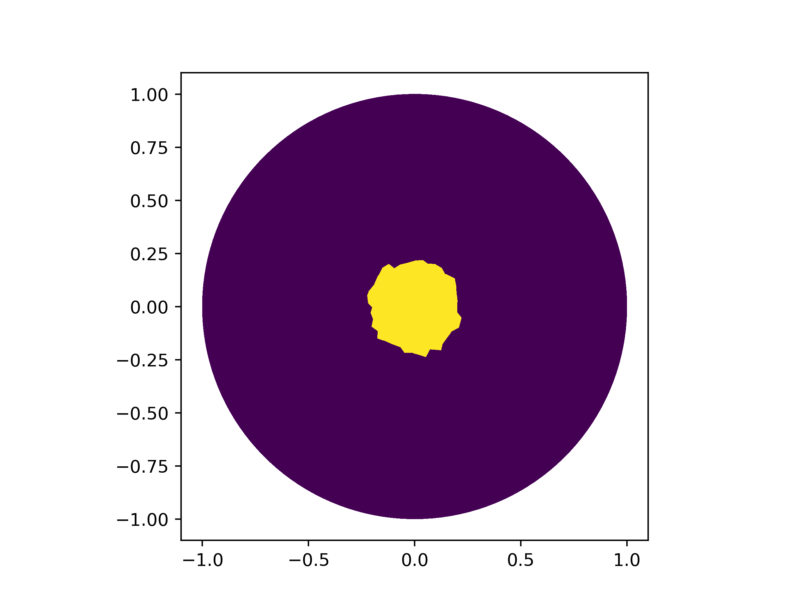

# JaxFEM

An exercise to implement a FEM solver using python and JAX
Jaxlib only works under Linux so this whole software is only usable under Linux-based operating systems.
Some functions are written in Rust for better performance but are kept in another repo. Run the setup_environment.py script
first to ensure your enviroment has all the necessary requirements.

## Poisson equation

Currently `main_poisson.py` solves a poisson equation with a right hand side equal to -1 and homogenous Dirichlet b.c.

$\nabla^2 u = -1$

Result is:

## Fick's law

`main_fick.py`  Solves the simplest form of the diffusion equation in 2D with homogenous Neumann b.c.

$\frac{\partial u}{\partial t} - \nabla^2 u = 0$

Output is:

## Advection-Diffusion

This builds on the previous example by adding an advection term.

`main_advection.py` is the solver for:

$\frac{\partial u}{\partial t} + \bar{b} \cdot \nabla u - \nabla^2 u = 0$

Where the particular choice for $\bar{b}$ simulates a fluid flow moving from the left to the right with a temperature of 0 degrees. Here the "dominant force" is the advection.

Output:

