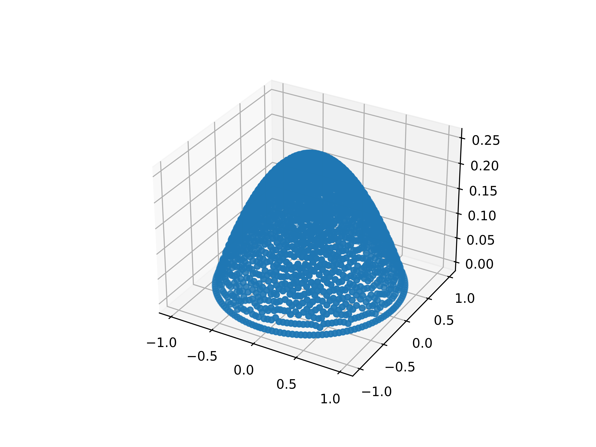
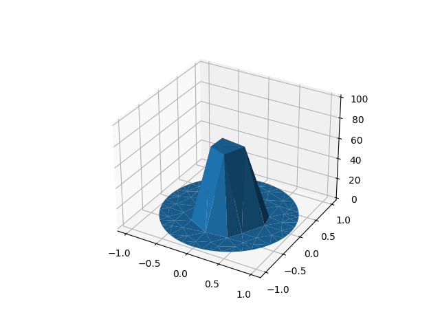

# JaxFEM

An exercise to implement a FEM solver using python and JAX

## Poisson equation

Currently main.py solves a poisson equation with a right hand side equal to -1 and homogenous Dirichlet b.c.

$\nabla^2 u = -1$

Result is:

## Fick's law

`main_fick.py`  Solves the simplest form of the diffusion equation in 2D with homogenous Neumann b.c.

$\frac{\partial u}{\partial t} + \nabla^2 u = 0$

Output is:

